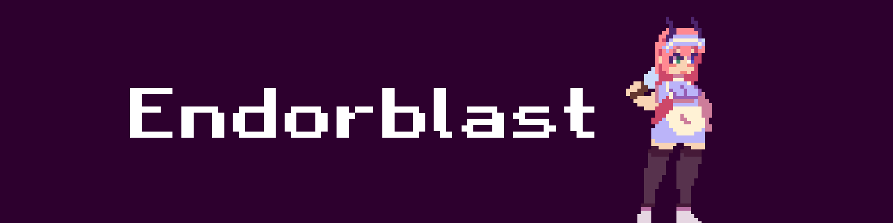
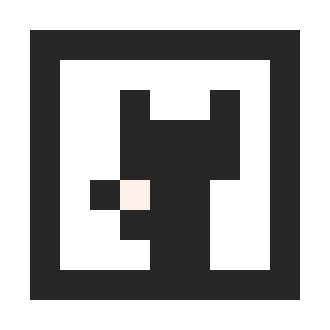
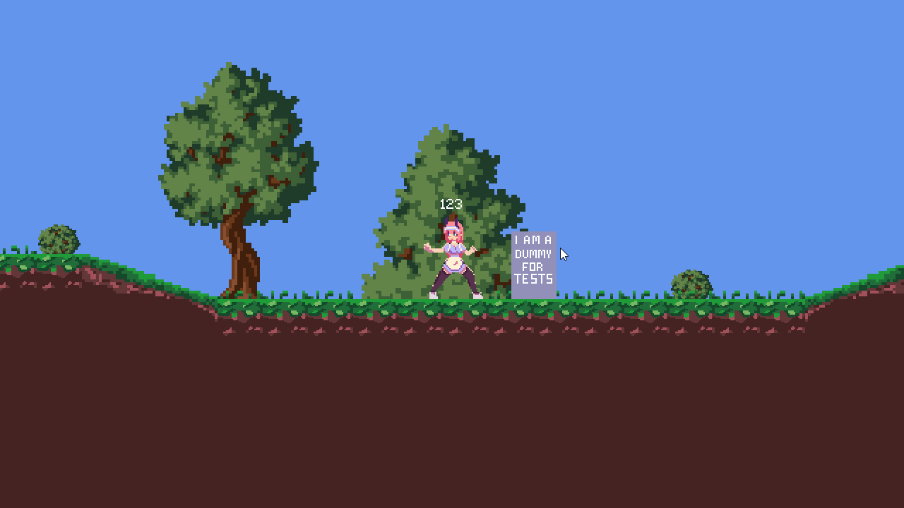

    
    
    
    
    

<h3 align="center"><b>Build Status</b>: Error </h3>

## Setup
I dont give assistance with setting it up.\
Program will not compile since its missing every sprite\
You need to remake all sprites and add them to the project

## FAQ
[Click here](/FAQ.md)

## License
You are allowed to use the game engine but give credits.\
I am allowed to change the license at anytime you need to be updated on what is relevant.\
Copying over our sprites to this source is not allowed! and will get you in trouble.

***Make your own sprites!***

## Discord
Join the discord if you wanna play our game!\
https://discord.gg/5U5uaft

## Libraries
[EndorblastCore.Lib](https://github.com/ZyroLUL/Endorblast) (My own library)\
[Monogame](https://www.monogame.net/)\
[Nez](https://github.com/prime31/Nez)\
[Lidgren](https://github.com/lidgren/lidgren-network-gen3/)

## Current state (Can be outdated (Is outdated))

